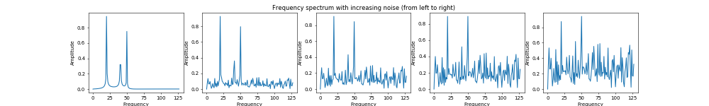
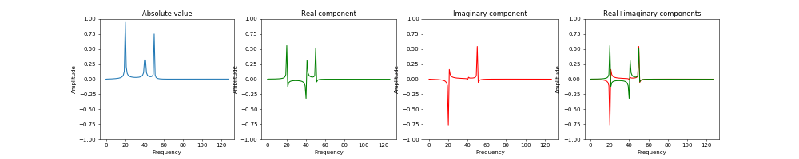
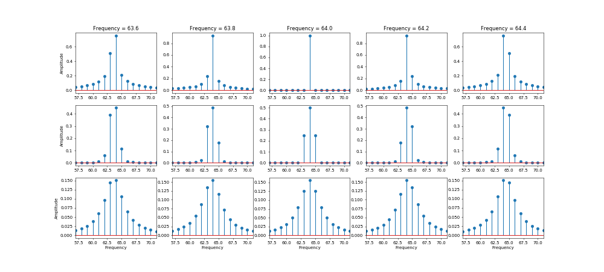
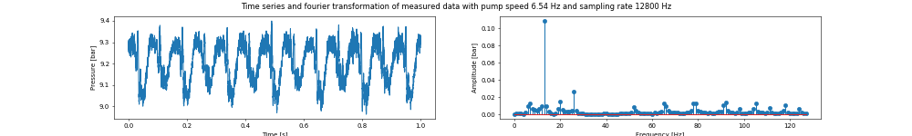
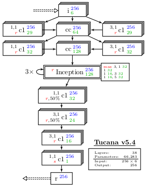
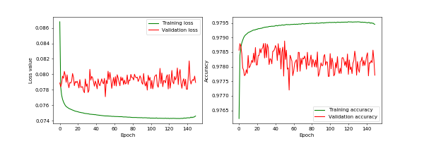
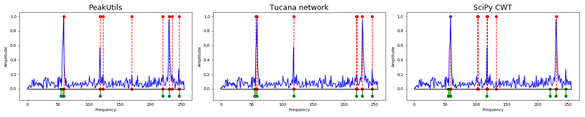

<a name="top"></a>
# Deep Interpretation Enhanced FFT (dieFFT) - Tucana

## First steps towards automatic fourier spectrum analysis

<hr>

- [Motivation](#intro)
- [Basic ideas](#basic)
- [Analytical training dataset](#adata)
- [Measurement dataset](#data)
- [Neural network model](#model)
- [Training process](#training)
- [Results](#results)
- [Conclusion](#conclusion)


<hr><a name="intro"></a><a href="#top" style="float:right;">top</a>

# Motivation
<hr>

Through a wide range of engineering tasks the measurement of physical properties over time (like pressure, torque, ...) and its interpretation using <a href="https://en.wikipedia.org/wiki/Fourier_transform" target="_blank">fourier transformations</a> is a common process of the workflow. A typical question in this regard is to find the dominant frequency components (and its <a href="https://en.wikipedia.org/wiki/Harmonic" target="_blank">harmonics</a>) within a noisy frequency spectrum. While for signals with few noise this problem isn't very hard, the more noise there is over the range of the whole spectrum, the more experience is required to distinguish frequency peaks among the random noise (see picture below).



This task to find peaks within a frequency spectrum is a <a href="https://en.wikipedia.org/wiki/Pattern_recognition" target="_blank">pattern recognition</a> problem. During the last years such pattern recognition problems increasingly have been solved applying <a href="https://en.wikipedia.org/wiki/Machine_learning" target="_blank">machine learning</a> techniques. Especially <a href="https://en.wikipedia.org/wiki/Neural_network" target="_blank">neural networks</a> in their different variants have been shown to be very successful in a range of different pattern recognition task (most prominently in image processing and <a href="https://en.wikipedia.org/wiki/Natural-language_processing" target="_blank">natural language processing</a>).

Within this work we show first steps of applying pattern recognition via neural networks to find the location of frequency peaks within fourier spectra. There are only a few papers which present similar approaches of applying neural networks for peak detection. None of those we know of are applying all the techniques and ideas we are using in our approach. And to the best of our knowledge none of them have been further advanced beyond peak detection towards spectral analysis, like we plan to.

In software for analying time series signals, peak detection within fourier spectra is handled via classical methods (e.g. <a href="https://en.wikipedia.org/wiki/Continuous_wavelet_transform" target="_blank">continuous wavelet transform</a> methods or simply by inclination change detectors with cutoff thresholds). The obtained results from our trained neural network are compared to those two methods for detecting peaks.


<hr><a name="basic"></a><a href="#top" style="float:right;">top</a>

# Basic ideas
<hr>

When manually interpreting data, we are automatically inclined to reduce the amount of informationen presented to a minimum, for being able to still make sense of them. As humans we are simply limited in the amount of information we are able to process simulatanously concerning a single task. 

In contrast when working with machine learning algorithms those limitations on the amount of information per decision are not relevant anymore. Thus additional data, which should provide additional information, can be added to the decision process. Actually alot of works in the domain of machine learning follow the "more data is better" philosophy.

Thus as the first step of developing our presented neural network, we investigated how to increase the amount of useful information per data entry. As a result we came up with the two techniques to increase the amount of data available for each decision which are presented in the following. Both of the concepts can be combined and thus be applied simultaneously.

## FFT results are complex values

When manually looking at a fourier spectrum, normally we're only looking at the absolute values of one half of the total fourier transformation. Since the fourier transformation produces symmetric results, obmitting one half of them will not reduce the information content. But looking only at the absolute value of the complex valued results of the fourier transformation does loose some information (including the phase shift information). The picture below shows the absolute, real and imaginary components of one specific fourier transformation.



As can be seen the real and imaginary components combined contain more information than only the absolute component. The reason why practially only the absolute component is used, is due to it's easier interpretability by humans. For our presented neural network we decided to supply all three components as inputs for each data entry. Thus all the information contained in the results of the fourier transformation can be used for learning the patterns.

## Spectral leakage and window functions

The second idea to enhance the information available for each data entry is based on the problem of <a href="https://en.wikipedia.org/wiki/Spectral_leakage" target="_blank">spectral leakage</a>. It is an inherent property of the applied <a href="https://en.wikipedia.org/wiki/Window_function" target="_blank">window function</a> in the discrete fourier transformation. While for the analytical fourier transformation the result of a sine signal is a dirac peak at the frequency of the sine, for the discrete fourier transformation the peak gets "blurred" within a small range around the actual frequency, the so-called spectral leakage. The exact pattern of the spectral leakage depends on the applied window function and how closely the discretized frequency matches the actual frequency.

The picture below shows the surrounding values of a frequency peak for different fourier transformation setups. From left to right the actual frequency of the sine signal is shifted inbetween the discrete frequency values. The upper row shows the application of the rectangular window, the middle applies the hanning window, and the bottom row uses a poisson or exponential window.



This picture demonstrates that depending on the applied window function different patterns of spectral leakage with different properties are created. For example the range of neighbouring values affected by the spectral leakage is much smaller for the hanning window (second row) than for the poisson window (lower row). As another example the shape of the spectral leakage of the poisson window (lower row) is mostly independent of the exact frequency value while for the rectangle window (upper row) the shape changes drastically.

In literature a whole bunch of different window functions are described, each with different properties that are benefical for some cases. Almost all of them are optimized to enhance the interpretability of a certain property within the resulting windowed fourier transformation. Typical optimization goals are to keep the resulting discrete amplitude as close to the real value as possible or to keep the number of effected neighbouring values as small as possible. Normally such optimization goals are opposing, such that there does not exist one "best" window function, but it depends on which kind of information the expert wants to recognize within the results.

Thus the obvious approach we apply to enhance the data available for our neural network to decide on the location of peaks is to provide multiple input fourier transformations with different window functions. Thus the network can be trained to recognize patterns in the fourier transform with the best possible window function for the current problem. It can even search for combined patterns across different window functions to further reduce the misclassification. For the human experienced user this kind of simultaneous interpretation of multiple fourier transformations with different window functions would be quite hard due to flood of information. Again this restriction on the amount of data does not apply for the neural network algorithm, thus we can feed it with all the possible advantagous data we can create by applying different, specialized window functions.


<hr><a name="adata"></a><a href="#top" style="float:right;">top</a>

# Analytical training dataset
<hr>

An analytical dataset was built to generated data to train on with exactly known spectra. This is very important, because for measurement data the ground truth is never clearly known. It is possible to train the network to ignore or misinterpret the information by using a dataset with unknown or unclear ground truth.

A signal of the analytical dataset is constructed by a specific number of single oscillations. Every single oscillation is based on the following formula:

**y<sub>i</sub>(t) = A<sub>i</sub> sin(2&pi; f<sub>i</sub> t + &phi;<sub>i</sub>)**

* Amplitude **A<sub>i</sub> &sim; &Uscr;(0.0, 2.0)**
* Frequency **f<sub>i</sub> &sim; &Uscr;(1, 255)**
* Phase **&phi;<sub>i</sub> &sim; &Uscr;(0, 2&pi;)**

The complete signal is represented by:

**s(t) = &epsilon; + A &sum;<sub>i=1..N</sub> y<sub>i</sub>**

* Amount of single oscillations **N &sim; &Uscr;(1, 36)**
* Noise **&straightepsilon; &sim; &Nscr;(0, &sigma;)**

The standard deviation of the white noise **&straightepsilon;** is choosen such that a certain SNR is achieved. The SNR is distributed as: 

**ln(SNR) &sim; &Nscr;(ln(2) + 0.5<sup>2</sup>, 0.5)**

These constructed time series represent systems with independent oscillations without harmonics. Thus the trained network can not recognize a bundle of harmonic oscillations as a single associated signal. The network will detect every oscillation as an independent oscillation.

Using this artifical, analytical signal generation method, a dataset consisting of about ``1`` million signals was constructed. The data where split in batches of ``1024`` signals, and ``1024`` such files were created. Each signal consists of a JSON string describing its construction from the basic oscillations with the according properties. Additionally the JSON contains a time series of the total resulting signal. Each of the files contains a gzipped JSON containing a list of such signal describing JSON strings.

In the ``./data/`` directory are included example files of a few of the data entries for this artifical dataset. The included data are already further processed and split into a file (``sample_signal.npy``) containing a list of the time series of the signal, a file (``sample_answer.npy``) containing the ground truth of peak locations and a file (``sample_config.npy``) containing additional information about the signals.

The whole dataset can be downloaded via FTP from <a href="ftp://ftp.ipat.uni-erlangen.de/tucana/" target="_blank">``ftp://ftp.ipat.uni-erlangen.de/tucana/``</a>. The data are either available as a single zip file (<a href="ftp://ftp.ipat.uni-erlangen.de/tucana/tucana_dataset.zip" target="_blank">``tucana_dataset.zip``</a>) of size ``15`` GB, or as ``1024`` individual files in the <a href="ftp://ftp.ipat.uni-erlangen.de/tucana/data/" target="_blank">``data``</a> directory, each about ``15`` MB of size.


<hr><a name="data"></a><a href="#top" style="float:right;">top</a>

# Measurement dataset
<hr>

Included within the repository are also some real measurements (``./data/eccentric_screw_pump.npy``) that were performed on an <a href="https://en.wikipedia.org/wiki/Progressive_cavity_pump" target="_blank">eccentric screw pump</a>. The file contains an array of measurements at different pump rotation speeds and system pressures. Each measurement consists of a dictionary containing averaged values and the measured data series (with sample and rate information) for the system pressure and the torque on the pump shaft. The picture below shows one sample from those measurements with the pressure curve on the left and the lower frequency range of its fourier transformation on the right.



Within the fourier transformation on the right side of the picture can be seen, that for real measurements the results are always noisy. Additionally we do not really know the ground truth for measurements. There has to be a frequency component according to the pump rotation speed and some of its harmonics. But which of the harmonics are really present with a significant amplitude is unknown. Also for possible peaks that do not fit the rotation speed and its harmonics, it is unknown whether they are just noise or true peaks due to other effects (e.g. from the motor, system resonance, neighbouring systems, ...). Thus the real measurements are not used for the training of the neural network, but are only used to qualitatively validate the resulting network afterwards.


<hr><a name="model"></a><a href="#top" style="float:right;">top</a>

# Neural network model
<hr>

As framework for building and training the neural network <a href="https://keras.io/" target="_blank">Keras</a> with <a href="https://www.tensorflow.org/" target="_blank">TensorFlow</a> backend was used. As input the network gets ``256 x 6`` data entries, representing ``6`` features of a ``256`` bins wide fourier transformation. The ``6`` features consist of two sets of absolute, real and imaginary part of the fourier transformation, for each of the rectangular and the hanning window function. As a result the network returns a vector of length ``256`` indicating the certainty for having a peak at the according location of the input data. The internal structure of the neural network is depicted in the picture below (or in the <a href="./docs/models/tucana_v5.4.pdf" target="_blank">PDF</a> in the docs subdirectory).



The neural network used for this work is a pure convolutional network. Over the whole network the data width ``256`` is kept constant.

The first layers of the network are classical feature extration layers consisting of parallel width-``1`` and width-``3`` ``1``-dimensional convolutions. Here the number of features is increased by either recombining some of the available features at the location or by combining the information with the neighbouring values. Two of the layers are stack upon each other to allow combination of both variants or increase the effective width of the combined convolution. At the end of this block there are ``128`` features each ``256`` width.

As the next building block of the neural network three times an <a href="https://arxiv.org/abs/1409.4842" target="_blank">Inception</a> like structured block is added. Analogous to the papers presenting the different versions of Inception, our Inception like structure consists of multiple parallel branches of convolutions with different width. Each branch consists of first a feature dimension reduction (by applying a width-``1`` convolution) and afterwards a wider convolution creating the new features. All those features are finally concatenated to the result of each Inception block. Each of our Inception block take as input ``128`` features and also returns ``128`` features.

The final block of layers consists of some more convolutional layers with varying widths. In contrast to the previous blocks, the final block successively reduces the number of resulting features until the final result of only ``1`` feature is reached. 

Throughout the whole network <a href="https://en.wikipedia.org/wiki/Rectifier_(neural_networks)" target="_blank">ReLU</a> is used as activation function. Only the last layer uses the classical SoftMax activation function. Within the final block <a href="http://jmlr.org/papers/volume15/srivastava14a/srivastava14a.pdf" target="_blank">Dropout</a> is applied to prevent overfitting. As loss function the binary cross-entropy is used and as solver for the minimization problem <a href="https://arxiv.org/abs/1412.6980" target="_blank">Adam</a> is used.

In total this neural network results in ``38`` layers with ``66,283`` parameters. Details of the network can also be found in the Jupyter notebook for creating the neural network (<a href="./models/generate_tucana_v5.4.ipynb" target="_blank">``./models/generate_tucana_v5.4.ipynb``</a>).


<hr><a name="training"></a><a href="#top" style="float:right;">top</a>

# Training process
<hr>

As a first preparation step for the training of the neural network, the artifical signal dataset was further pre-processed to better fit the required inputs and ground truth formats. Details on the pre-processing can be found in the pre-processing Jupyter notebook (<a href="./data/extract_data.ipynb" target="_blank">``./data/extract_data.ipynb``</a>), and in the python script containing a data handler for the dataset (<a href="./data/data_handler.py" target="_blank">``./data/data_handler.py``</a>).

The training itself is handled by a command line python script (<a href="./training/train_tucana_v5.4.py" target="_blank">``./training/train_tucana_v5.4.py``</a>) with many command line parameters to customize the training process. Additionally a wrapper Jupyter notebook (<a href="./training/train_tucana_v5.4.ipynb" target="_blank">``./training/train_tucana_v5.4.ipynb``</a>) for running the actual script with all the parameters set accordingly ist provided. Using this kind of separations allows for the training to be done on hardware without Jupyter notebook support.

The training script takes care of the whole training process, from loading the data, handling data augmentation, loading and compiling the neural network, starting and managing the training process to finally storing the resulting data and progress statistics. Many of those processes can further be customized by running the script with the according command line parameters. A list of the supported command line arguments can be seen at the top of the script (or can be found already pre-set in the wrapper Jupyter notebook).

Internally the training script depends not only on the Keras framework with its TensorFlow backend, but also on an internal library for data handling. This library is mainly used for managing the loading and augmentation of the data via a data generator class. The library is an internal "work in progress" and not published yet, but we plan to provide it in the future and it can then be found on <a href="https://github.com/FAU-iPAT/toolbox" target="_blank">GitHub (dieFFT.toolbox)</a>. Even though the provided training script is not runnable without this library, the reader should still be able to follow the principle process within the script.

The actual training of the neural network was done on a <a href="https://developer.nvidia.com/embedded/buy/jetson-tx2-devkit" target="_blank">NVidia Jetson TX2 development kit</a> board using its GPU for speedup. The dataset was split into training (``70%``), validation (``20%``) and testing (``10%``) data. The network was trained for ``150`` epochs which took an average time of ``27`` minutes per epoch. The following picture shows the loss function and accuracy (both training and validation) over the training epochs.



The graphs show, that the neural network reaches almost top validation accuarcy already after the first training pass over the training data. The following epochs only slightly increase the performance of the neural network, both for the training and the validation accuracy. While the training accuracy is slightly better than the validation accuracy, the difference and trends of both seem not to indicate an overfitting problem. Also the closeness of the validation accuarcy to the training accuarcy indicates that the neural network is quite able to generalize the pattern from the training data to new, unseen data.

Some data of the training process and the resulting trained neural network are contained within the ``./results/`` directory:
* TensorBoard file containing training progress statistics (``events.out.tfevents.1462514264.loki``)
* Output logfile of the training process (``tucana5.4_logs.txt``)
* Training progress statistics as numpy arrays (``tucana5.4_runstats.npy``)
* Weights of the best validation accuracy epoch (``tucana5.4_weights.hdf5``)


<hr><a name="results"></a><a href="#top" style="float:right;">top</a>

# Results
<hr>

As results the performance of the trained neural network was compared to the results of two other methods for peak detection. The first comparison method from the PeakUtils package is an inclination change based method with cut-off threshold. The second method from the SciPy package is based in CWT. The results are presented in a separate <a href="./results/tucana5.4_results.ipynb" target="_blank">Jupyter Notebook (``./results/tucana5.4_results.ipynb``)</a>, which allows the interested reader to easily test variations on the results for themself.



The picture above shows one of the results from the notebook. The predictions (red) of the three methods for peaks in an artifically created signal (blue) are shown and compared to the known ground truth peak locations (green). For each method the best possible parameters have been chosen to get the best possible prediction of the peak locations.

Within the notebook it is demonstrated in more detail, that the tucana neural network based method outperforms the two other methods, especially for more noisy signals. In addition it is shown that the tucana method is also less dependent on the optimal choice of its parameters compared to the other methods. For more details please have a look at the notebook presenting the results.


<hr><a name="conclusion"></a><a href="#top" style="float:right;">top</a>

# Conclusion
<hr>

This work demonstrates how neural networks can be trained to detect peak locations in fourier spectra. This can be seen as a first step towards automatic fourier spectra analysis. The results of the trained neural network were then compared to the results of classical methods for peak detection. As a conclusion the following characteristics of the tucana neural network method compared to the classical methods could be shown:
- Lower false negative rates; less likely to not find ground truth peaks
- Lower false positive rates (especially for noisy signals); no cluttering of peaks everywhere for noisy signals
- Mostly independent of it's certainty parameter; no signal specific fine-tuning of parameters required

Overall the method demonstrated its applicability to the presented problem of peak detection with the potential to be an improvement over the other classical methods for peak detection. But nonetheless this method currently has its limitations, which are listed below:
- Also not applicable to very noise signal (like the classical methods); no peaks detected compared to cluttering of peaks for classical methods
- Problems in recognizing distorted sine signals (frequency and amplitude modulation)

Especially the problem of distorted signals is mainly based on the artifical dataset used for training the neural network. The current dataset does not include frequency or amplitude modulation, which naturally results in the trained neural network to have problems recognizing such signals. Thus one of the next steps in the development of this method will be to include modulated signals in the training set, which should reduce this current shortcoming of the peak detection method.

Also other improvements and further developments are planned and the results of those will be published as soon as their research is concluded. If you are interested in our work and future results feel free to check our <a href="https://www.ipat.tf.fau.de/" target="_blank">website (https://www.ipat.tf.fau.de/)</a> or our <a href="https://github.com/FAU-iPAT" target="_blank">GitHub repositories</a> where future results will also be published.


<hr>

```
Copyright 2018 FAU-iPAT (http://ipat.uni-erlangen.de/)

Licensed under the Apache License, Version 2.0 (the "License");
you may not use this file except in compliance with the License.
You may obtain a copy of the License at

    http://www.apache.org/licenses/LICENSE-2.0

Unless required by applicable law or agreed to in writing, software
distributed under the License is distributed on an "AS IS" BASIS,
WITHOUT WARRANTIES OR CONDITIONS OF ANY KIND, either express or implied.
See the License for the specific language governing permissions and
limitations under the License.
```
